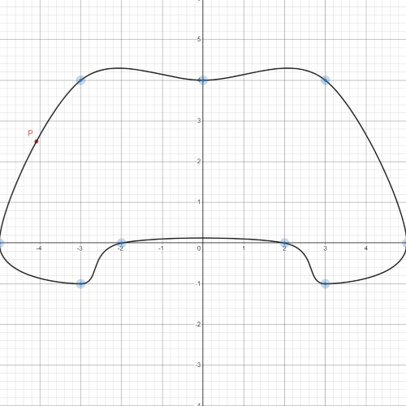
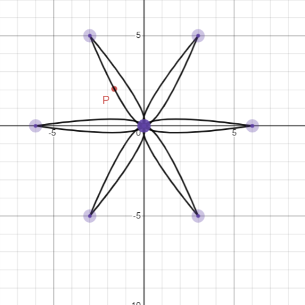
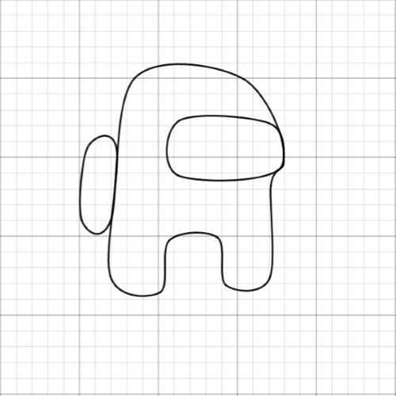

# Catmull-Rom
> Implementation of Catmull-Rom spline in Desmos

Here is the [link](https://www.desmos.com/calculator/6hcgyvkisa) to the graph.

## Preview
<iframe src="https://www.desmos.com/calculator/6hcgyvkisa?embed" width="500" height="500" style="border: 1px solid #c0514f" frameborder=0></iframe>

### Images

  
Nothing to see here 👀 ඞඞ 

  

